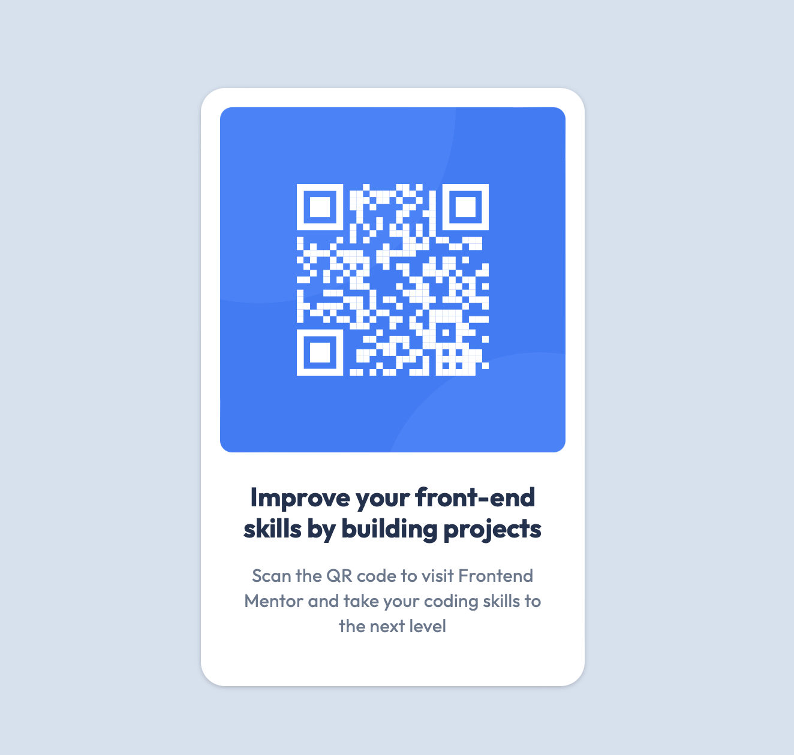

# Frontend Mentor - QR code component solution

This is a solution to the [QR code component challenge on Frontend Mentor](https://www.frontendmentor.io/challenges/qr-code-component-iux_sIO_H). Frontend Mentor challenges help you improve your coding skills by building realistic projects. 

## Table of contents

- [Overview](#overview)
  - [Screenshot](#screenshot)
  - [Links](#links)
- [My process](#my-process)
  - [Built with](#built-with)
  - [What I learned](#what-i-learned)
- [Author](#author)

## Overview

### Screenshot

### Links

- [Solution URL](https://github.com/edpau/fm_qr-code-component)
- [Live Site URL](https://edpau.github.io/fm_qr-code-component/)

## My process

### Built with

- Semantic HTML5 markup
- Mobile-first workflow
- CSS Flexbox
- CSS BEM

### What I learned

#### CSS

##### Flexbox- gap vs Margin

###### Problem:
- I tried to match the card height in the Figma file, I started with with `margin-bottom: 24px` on the image to create the gap between image and the text box.
- Noticed extra vertical space added when using `margin-bottom`, even though the developer tools showed a 24px margin.

###### Solution:
- Replaced `gap: 24px` in the `.card` flex container with `margin-bottom: 24px` on the image.

###### Explanation:
- **Margin:**
  - Adds space outside the element.
  - Can cause issues like collapsing margins, where vertical margins between elements may combine into a single margin, leading to inconsistent spacing.
  - Margins contribute to the overall height of the container, possibly causing the "extra" space you observed.

- **Gap:**
  - Adds space only between flex items (child elements).
  - Does not affect the space outside the elements, leading to more consistent and predictable spacing.
  - Ideal for ensuring even spacing between items in a flexbox or grid layout without influencing the overall height of the container.

###### Recommendations:
- **Use `gap` in Flexbox/Grid Layouts**: It provides consistent, predictable spacing between items.
- **Avoid Margins for Spacing Between Flex Items**: Margins can lead to unpredictable extra space and are more complex to manage in a layout.
- **Choose `gap` for simpler and more reliable layout control.**

## Author
- Website - [Edward Pau](https://www.edpau.me)
- Frontend Mentor - [@edpau](https://www.frontendmentor.io/profile/edpau)

